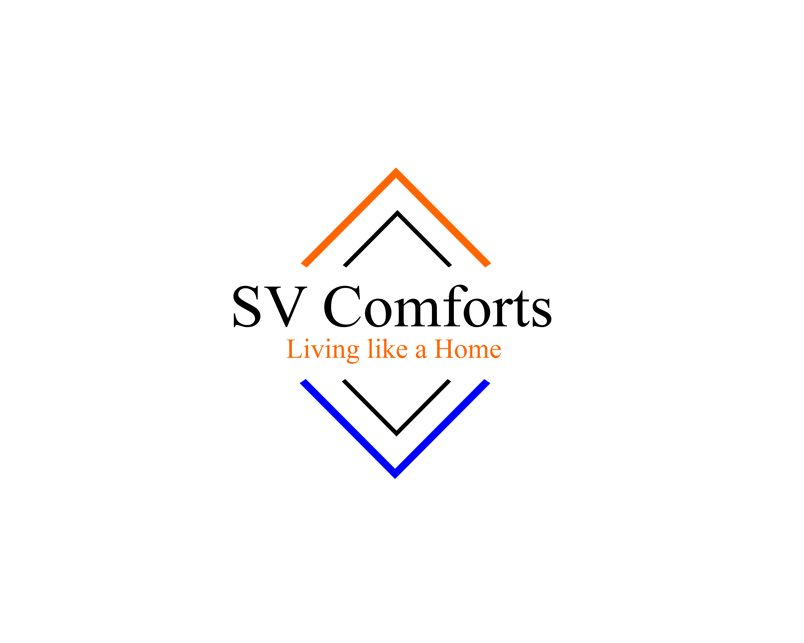

<!DOCTYPE html>
<html lang="en">
<meta http-equiv="content-type" content="text/html" />

<head>
    <meta charset="UTF-8">
    <meta name="viewport" content="width=device-width, initial-scale=1, maximum-scale=1, user-scalable=0">
    <title>SVComforts</title>
    <link rel="icon" href="images/logo.png" sizes="42x42" type="image/png">   
    <link href="https://fonts.googleapis.com/css?family=Roboto+Condensed" rel="stylesheet"> 
    <link rel="stylesheet" href="bootstrap.min.css" type='text/css' />
    <link rel='stylesheet' id='bigappcompany-style-css' href='style.css' type='text/css' /> 
    <link rel="stylesheet" href="font-awesome.min.css" />
    <link rel="stylesheet" href="jqtransform/jqtransform.css"/>
    <link rel="stylesheet" href="foundation-datepicker.min.css" />
     
</head>
<header class="block">
        

            

                
            

        
             <nav class="navbar ">
                

                  <button type="button" class="navbar-toggle" data-toggle="collapse" data-target="#myNavbar">
                    
                    
                    
                  </button>
                  
                

                

                  <ul class="nav navbar-nav">
                                        <li class="hidden-sm hidden-lg hidden-md"><a href="#0" class="transition">Careers</a></li>
                    <li class="hidden-sm hidden-lg hidden-md"><a href="http://halfbhk.com/about-us" class="transition">About Us</a></li>
                    <li class="hidden-sm hidden-lg hidden-md"><a href="#0" class="transition">Privacy Policy</a></li>
                    <li class="hidden-sm hidden-lg hidden-md"><a href="http://halfbhk.com/faq" class="transition">Tenancy Terms</a></li>
                    <li class="hidden-sm hidden-lg hidden-md"><a href="#0" class="transition">Half BHK Terms of Use</a></li>
                    <li class="hidden-sm hidden-lg hidden-md"><a href="http://halfbhk.com/contact-us" class="transition">Contact Us</a></li>
                    <!-- <li><a href="http://halfbhk.com/reschedule" class="transition">My Scheduled Visits</a></li> -->
                    
                    <li><a href="http://svcomforts.com/tenancy-policy" class="transition">Tenancy Policies</a></li>
                                        
                  </ul>
                

            </nav>
        

        
    </header>
    
<section class="block bodycontainer">
        <section class="block bannercontainer">
            

                <h1>SV Comforts mens PG</h1>
                <h2>Living like a home. Fee starts from <i class="fa fa-inr" aria-hidden="true"></i>
 5000 / month</h2>
                

                    <a href="#footer" class="customised_btn btn hoverbtn"> Contact us</a>
                    <a href="#singleslovehalfbhk" class="customised_light_btn btn hoverbtn">Amenities</a>
                

                     
            

            
        </section>
        <!--<section class="block whatweoffe textaligncenter sectionpadding50 alternatebgcolor">
            

                

                    

                        

                            
                            <h4>Comfortable Rooms</h4>
                            <article>Spacious bedrooms with classy decor ensures that you always feel at home</article>
                        

                    

                    

                        

                            
                            <h4>Hassle-Free Stay</h4>
                            <article>Don't worry about water, housekeeping, internet, power and security</article>
                        

                    

                    

                        

                            
                            <h4>Social Experience</h4>
                            <article>Enjoy and network in recreational lounges with like-minded people</article>
                        

                    

                

            

        </section>-->
        <!--<section class="block sectionpadding50 textaligncenter">
            

                <h3 class="title  marginbottom20">These are the lines of living we offer:</h3>
                

                    

                        

                            

                                

                                     
                                    <h4>Standard</h4>
                                
                                
                                

                               
                            

                            

                                 

                                

                                New to Bangalore? Need a place to crash after a hard day of work? We have a large number of fully furnished PG's with all your needs including food and WiFi taken care of. 
                                

                                

                            

                        

                    

                    

                        

                            

                                

                                
                                
                                     <h4>Premium</h4>
                                

                            

                            

                                

                                

                                Share accommodation with friends by booking a room in one of the premium apartments we have to offer. Feel like home in the fully furnished flats with all amenities including free WiFi we give you.
                                

                                

                            

                        

                    

                    

                        

                            

                                

                                
                                     <h4>Family</h4>
                                
                                

                            

                            

                                

                                

                                Planning on moving to Bangalore with your family? We help you find your perfect home. Book an entire, fully furnished flat with all amenities included, to stay with your family or friends.
                                

                                

                            

                        

                    

                

            

        </section>-->
        <!--<section class="block whatweoffe textaligncenter sectionpadding50 alternatebgcolor" id="howitworks">
             <h3 class="title  marginbottom20">How It Works</h3>
            

                

                    

                        

                            
                            <h4>Search</h4>
                            <article>Search for rental houses on HalfBHK based on your requirements  
                              <!--  <b>Locality</b> 
                                <b>Budget</b> 
                                <b>Sharing</b>-->
                            <!--</article>
                        

                    

                    

                        

                            
                            <h4>Schedule</h4>
                            <article>Forget about repairs, housekeeping, internet, power woes and be care-free</article>
                        

                    

                    

                        

                            
                            <h4>Book</h4>
                            <article>Enjoy and network in recreational lounges with like-minded people 
                              <!--   <b>No brokerage,</b> 
                                 <b>3-Days Money back Guarantee, </b> 
                                 <b>2 Months security deposit </b> -->
                            <!--</article>
                        

                    

                

            

        </section>
        <section class="block featuredhomes-container sectionpadding50">
            

                <h3 class="title textaligncenter">Newly added</h3>
                <h4 class="subtitle textaligncenter  marginbottom20">Fully Furnished HalfBHK Homes for Rent</h4>
                

                                    

                

                

                    

                        <!-- 

                            <a href="http://halfbhk.com/listing" class="customised_btn btn hoverbtn transition"> View all Featured Homes </a>
                        
 -->
                    <!--

                

            

        
        </section>-->
          <section class="block whysingleslikehalfbhk sectionpadding50 " id="singleslovehalfbhk">
                

                    <h3 class="title textaligncenter me-padd">Amenities</h3>
                    

                        

                            

                                
                                
 High speed free wifi
                            

                        

                        

                            

                                
                                
 TV with seperate setup box
                            

                        

                        

                            

                                
                                
 Elevator with power backup 24X7
                            

                        

                        

                            

                                
                                
 CC cameras installed in all corridors for Security Purpose
                            

                        

                    

                    

                        

                            

                                
                                
 Hot water/Cool water available round the clock
                            

                        

                        

                            

                                
                                
 water filter system available for drinking water
                            

                        

                        

                            

                                
                                
 North Indian/ South Indian food items available. Lunch box will be prepared for working men.
                            

                        

                        

                            

                                
                                
 Customized kitchen available. If you want make your food, you could do it.
                            

                        

                    

                

            </section>
            <!--
            <section class="block featuredhomes-container sectionpadding50 textaligncenter no-pad ">
                

                    

                    <h3 class="title ">You are not alone. Who else trusts HalfBHK ? </h3>
                    <h4 class="subtitle  marginbottom20">1000 people and counting. And that's when we've only just begun! See what other HalfBHK customers have to say: </h4>
                    
                    

                        

                        <!-- Indicators -->
                        <!--<ol class="carousel-indicators">
                            <li data-target="#myCarousel" data-slide-to="0" class="active"></li>
                            <li data-target="#myCarousel" data-slide-to="1"></li>
                            <li data-target="#myCarousel" data-slide-to="2"></li>
                            <li data-target="#myCarousel" data-slide-to="3"></li>
                        </ol>

                        <!-- Wrapper for slides -->
                       <!-- 

                        
                                                      

                                

                                    

                                        

                                            

                                                
                                            

                                        

                                        

                                            
We couldn't have found such a comfort home to live in such an affordable price. They're Beautiful and nice. 

                                            
<b>- Ravi</b>

                                        

                                    

                                

                            

                                                    

                                

                                    

                                        

                                            

                                                
                                            

                                        

                                        

                                            
Well the people who made me shift into the room were absolutely professional. If feels like family. 

                                            
<b>- Harshal</b>

                                        

                                    

                                

                            

                                                 
                         
                        

                        <!-- Left and right controls -->
                        <!--
                        
                    

                     

<!--                    
<a href="#">More Testimonials</a>
-->
                  <!--  

                    <a href="" class="customised_light_btn btn hoverbtn">More Testimonials</a>
                
 -->
                <!--

            </section>-->

        

    
<footer class="block">
            

                

                

                                        

                                        

                            

                                
                            

                            
                            

                               <h5>svcomforts.com</h5>
                                SV Comforts Luxury Paying Guest for Gents, 
                                #50, 19th Cross Road, 
                                HBR Layout, 5th Block, 
                                Nagawara, Outer Ring Road, 
                                Near Manyata Tech Park, Bengaluru, Karnataka- 560 043. 
                                
                                

                                    <ul>
                                    <li><a href="https://www.facebook.com/"><i class="fa fa-facebook" aria-hidden="true"></i> </a></li>
                                    <li><a href="#0"><i class="fa fa-twitter" aria-hidden="true"></i>  </a></li>
                                    <li><a href="#0"><i class="fa fa-linkedin" aria-hidden="true"></i>  </a></li>
                                    <li><a href="#0"><i class="fa fa-pinterest" aria-hidden="true"></i>  </a></li>
                                    <li><a href="#0"><i class="fa fa-youtube" aria-hidden="true"></i>  </a></li>
                                </ul>
                            

                            

                        
                        

                    

                                        

                        

                           email us on support@svcomforts.com  or call us at  8880 14 34 39  
                            <ul>
                                <li><a href="https://www.facebook.com/"><i class="fa fa-facebook" aria-hidden="true"></i> </a></li>
                                <li><a href="#0"><i class="fa fa-twitter" aria-hidden="true"></i>  </a></li>
                                <li><a href="#0"><i class="fa fa-linkedin" aria-hidden="true"></i>  </a></li>
                                <li><a href="#0"><i class="fa fa-pinterest" aria-hidden="true"></i>  </a></li>
                                <li><a href="#0"><i class="fa fa-youtube" aria-hidden="true"></i>  </a></li>
                            </ul>
                            
SV Comforts serve you all your needs. Lunch box facility will be provided for working men. Different types of rooms avaliable upon your requirement. First three days after joining would be free

                        

                    

                    

                        <section class="block footerquicklinks" id="footer">
                            <ul>
                              <!--  <li><a href="#0">Careers</a></li>
                                <li><a href="#0">Terms & Conditions</a></li>
                                <li><a href="#0">Privacy Policy</a></li> -->
                                <li><a href="http://svcomforts.com/about-us">About Us</a></li>
                                <li><a href="http://svcomforts.com/faq">FAQs</a></li>
                                <li><a href="http://svcomforts.com/contact-us">Contact Us</a></li>
                            </ul>
                        </section>
                    

                                    

            

                <section class="footerbg"></section>
            

            

                

                

                    

                        

                             &copy; SVComforts - All rights reserved 
                        

                    

                    
                

            

            

        </footer>
    </section>
   
    
    
    <link rel="stylesheet" href="http://halfbhk.com/assets/frontend/resources/calender/foundation-datepicker.min.css" />
        
     
     

     
        <!--  -->

  <!--    
<!-- 
     -->
   
   <!--  
     -->
</body>

</html>
